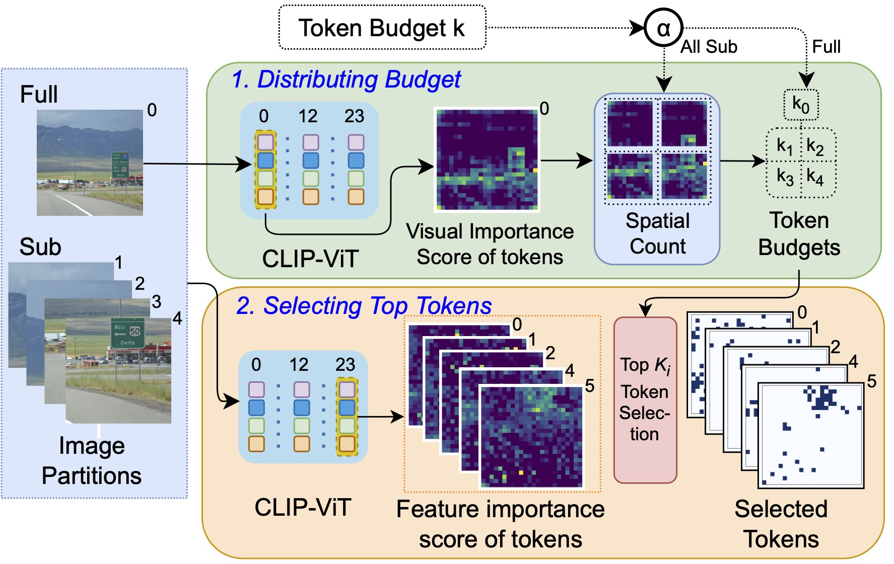
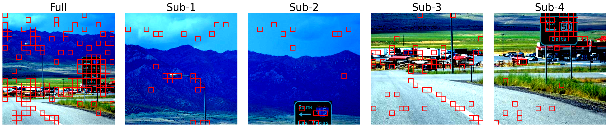

# HiRED: Attention-Guided Token Dropping for Efficient Inference of High-Resolution Vision-Language Models in Resource-Constrained Environments

_TL;DR:_ HiRED strategically drops visual tokens in the image encoding stage to improve inference efficiency for High-Resolution Vision-Language Models (e.g., LLaVA-Next) under a fixed token budget.

**Paper Link:** [https://www.arxiv.org/abs/2408.10945](https://www.arxiv.org/abs/2408.10945)

### Abstract:

High-resolution Vision-Language Models (VLMs) have been widely used in multimodal tasks to enhance accuracy by preserving detailed image information. However, these models often generate excessive visual tokens due to encoding multiple partitions of the input image. Processing these excessive visual tokens is computationally challenging, especially in resource-constrained environments with commodity GPUs. To support high-resolution images while meeting resource constraints, we propose High-Resolution Early Dropping (HiRED), a token-dropping scheme that operates within a fixed token budget before the Large Language Model (LLM) stage. HiRED can be integrated with existing high-resolution VLMs in a plug-and-play manner, as it requires no additional training while still maintaining superior accuracy. We strategically use the vision encoder’s attention in the initial layers to assess the visual content of each image partition and allocate the token budget accordingly. Then, using the attention in the final layer, we select the most important visual tokens from each partition within the allocated budget, dropping the rest. Empirically, when applied to LLaVA-Next-7B on NVIDIA TESLA P40 GPU, HiRED with a 20% token budget increases token generation throughput by 4.7, reduces first-token generation latency by 15 seconds, and saves 2.3 GB of GPU memory for a single inference.

<div align="center">
    
</div>

_**HiRED Overview:** 1. Distributing Budget: A fixed token budget (i.e., 10%) is distributed across image partitions based on their visual importance score; and 2. Selecting Top Tokens: The most important tokens are selected (i.e., the rest are dropped) based on their feature importance score from image partitions within their allocated budget._

<div align="center">
    
</div>

_**Visualization:** For example, when a 10% token budget is set, HiRED distributes the budget among the image partitions (full and sub-images) and selects the most important tokens from each partition. The selected tokens are shown in red boxes._

## Installation and Setup

```bash
conda create --name hired python=3.10
conda activate hired
pip install -e transformers
pip install -e lmms-eval
pip install sentencepiece seaborn ipykernel
```

## Contents

1. The main implementation of HiRED is in [modeling_llava_next](transformers/src/transformers/models/llava_next/modeling_llava_next.py)
2. The single image partition version of HiRED (based on llava-1.5) is in [modeling_llava](transformers/src/transformers/models/llava/modeling_llava.py)
3. The accuracy evaluation scripts for selected benchmarks are in [accuracy_benchmarks](accuracy_benchmarks)
4. The inference efficiency (throughput, time-to-first-token latency, and GPU memory usage) evaluation scripts are in [run_HiRED_sys_report.py](run_HiRED_sys_report.py)
5. The visualization scripts for HiRED token selection is in [view_HiRED_token_selection.ipynb](view_HiRED_token_selection.ipynb)
6. Our main baselines (PruMerge and PruMerge+) is implemented in [prumerge_llava_next.py](prumerge_llava_next.py). To run them, paste the code from this file into [modeling_llava_next.py](transformers/src/transformers/models/llava_next/modeling_llava_next.py). To toggle between PruMerge and PruMerge+, change the `use_prumerge_plus` flag in the code.

## Citation

If you find this work useful, please consider citing:

```bibtex
@misc{hasan2024hired,
      title={HiRED: Attention-Guided Token Dropping for Efficient Inference of High-Resolution Vision-Language Models in Resource-Constrained Environments},
      author={Kazi Hasan Ibn Arif and JinYi Yoon and Dimitrios S. Nikolopoulos and Hans Vandierendonck and Deepu John and Bo Ji},
      year={2024},
      eprint={2408.10945},
      archivePrefix={arXiv},
      primaryClass={cs.CV},
      url={https://arxiv.org/abs/2408.10945},
}
```
