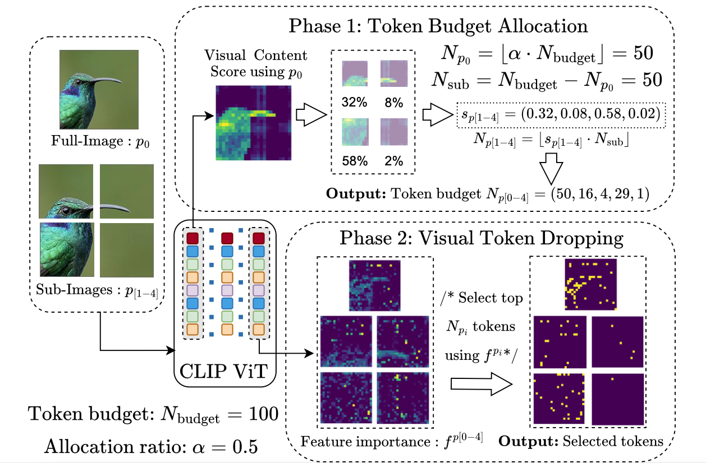
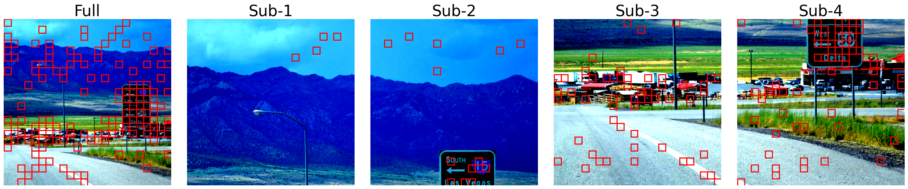

# HiRED: Attention-Guided Token Dropping for Efficient Inference of High-Resolution Vision-Language Models

🔥 **HiRED is accepted at AAAI 2025!** 🎉

### Abstract:

High-resolution Vision-Language Models (VLMs) are widely used in multimodal tasks to enhance accuracy by preserving detailed image information. However, these models often generate an excessive number of visual tokens due to the need to encode multiple partitions of a high-resolution image input. Processing such a large number of visual tokens through multiple transformer networks poses significant computational challenges, particularly for resource-constrained commodity GPUs. To address this challenge, we propose High-Resolution Early Dropping (HiRED), a plug-and-play token-dropping method designed to operate within a fixed token budget. HiRED leverages the attention of CLS token in the vision transformer (ViT) to assess the visual content of the image partitions and allocate an optimal token budget for each partition accordingly. The most informative visual tokens from each partition within the allocated budget are then selected and passed to the subsequent Large Language Model (LLM). We showed that HiRED achieves superior accuracy and performance, compared to existing token-dropping methods. Empirically, HiRED-20% (i.e., a 20% token budget) on LLaVA-Next-7B achieves a 4.7x increase in token generation throughput, reduces response latency by 78%, and saves 14% of GPU memory for single inference on an NVIDIA TESLA P40 (24 GB). For larger batch sizes (e.g., 4), HiRED-20% prevents out-of-memory errors by cutting memory usage by 30%, while preserving throughput and latency benefits.

<div align="center">
    
</div>

_**HiRED Overview:** Phase 1: Token Budget Allocation. A fixed token budget (i.e., 100) is distributed across image partitions based on their visual content score; and Phase 2: Visual Token Dropping. The most informative visual tokens are selected (i.e., the rest are dropped) based on their feature importance score from image partitions within their allocated budget._

<div align="center">
    
</div>

_**Visualization:** For example, when a 10% (~247 tokens) budget is set, HiRED distributes the budget among the full and sub-images (sub 1-4). Then HiRED selects the most informative tokens from each partition under allocated budget and drops the rest. The selected tokens are shown in red boxes._

## Installation and Setup

1. Install [Miniconda](https://docs.conda.io/en/latest/miniconda.html) or [Anaconda](https://www.anaconda.com/).
2. Clone this repository:
   ```bash
   git clone https://github.com/hasanar1f/HiRED.git
   cd HiRED
   ```
3. Create a new conda environment:
   ```bash
    conda create --name hired python=3.12
    conda activate hired
    pip install -e transformers
    pip install -e lmms-eval
    pip install sentencepiece seaborn ipykernel
    ```

## Contents

1. The main implementation of HiRED is in [modeling_llava_next](transformers/src/transformers/models/llava_next/modeling_llava_next.py)
2. The single image partition version of HiRED (based on llava-1.5) is in [modeling_llava](transformers/src/transformers/models/llava/modeling_llava.py)
3. The accuracy evaluation scripts for selected benchmarks are in [accuracy_benchmarks](accuracy_benchmarks)
4. The inference efficiency (throughput, time-to-first-token latency, and GPU memory usage) evaluation scripts are in [run_HiRED_sys_report.py](run_HiRED_sys_report.py)
5. The visualization scripts for HiRED token selection is in [view_HiRED_token_selection.ipynb](view_HiRED_token_selection.ipynb)
6. Our main baselines (PruMerge and PruMerge+) is implemented in [prumerge_llava_next.py](prumerge_llava_next.py). To run them, paste the code from this file into [modeling_llava_next.py](transformers/src/transformers/models/llava_next/modeling_llava_next.py). To toggle between PruMerge and PruMerge+, change the `use_prumerge_plus` flag in the code.
7. An implementation of HiRED in ShareGPT4V [ECCV 2024] is in [ShareGPT4V](ShareGPT4V). Please follow the instructions in the [ShareGPT4V README](ShareGPT4V/README.md).


## Citation

If you find this work useful, please consider citing:

```bibtex
@misc{arif2024hired,
      title={HiRED: Attention-Guided Token Dropping for Efficient Inference of High-Resolution Vision-Language Models}, 
      author={Kazi Hasan Ibn Arif and JinYi Yoon and Dimitrios S. Nikolopoulos and Hans Vandierendonck and Deepu John and Bo Ji},
      year={2024},
      eprint={2408.10945},
      archivePrefix={arXiv},
      primaryClass={cs.CV},
      url={https://arxiv.org/abs/2408.10945}, 
}
```
